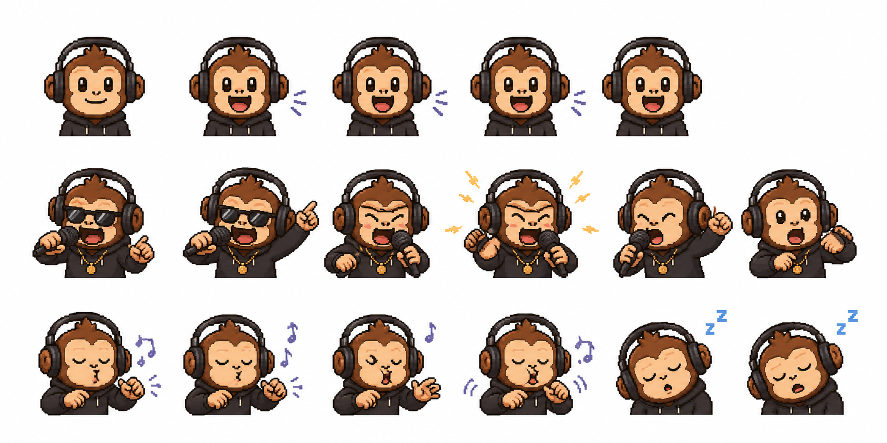
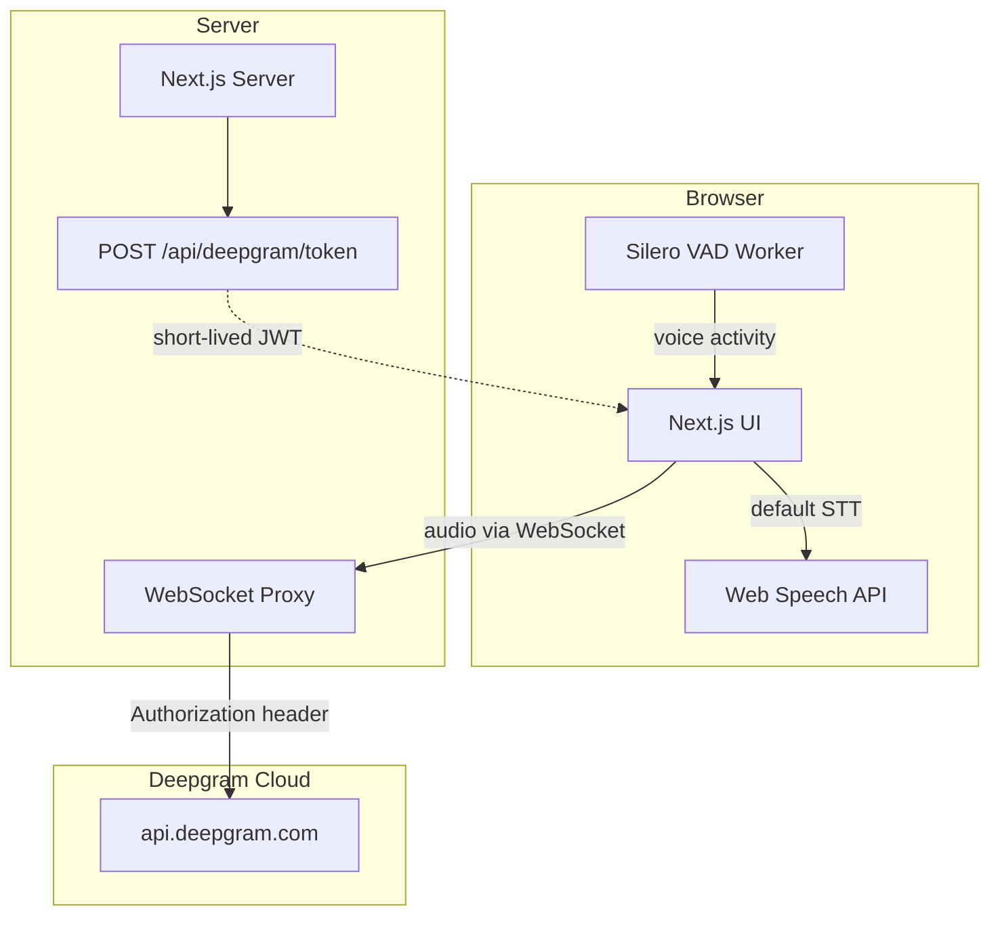
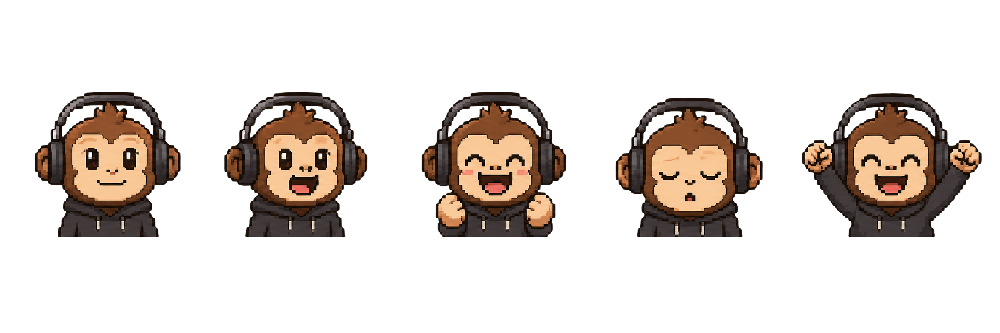
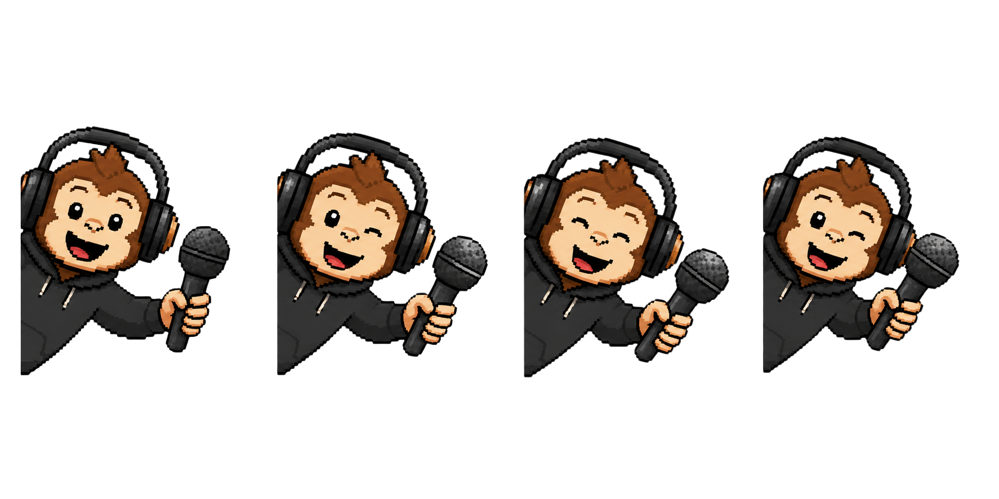

<p align="center">
  
</p>

<p align="center">
  
</p>

<h1 align="center">MonkeySpeak</h1>

<p align="center">
  <strong>How fast can you speak?</strong><br />
  Read it. Say it. Beat your score.
</p>

<p align="center">
  The spoken equivalent of <a href="https://monkeytype.com">MonkeyType</a> — a minimalist voice benchmark for speed and clarity.
</p>

<p align="center">
  
  
  
  
</p>

---

## What is MonkeySpeak?

MonkeySpeak measures **how fast** and **how clearly** you speak. Pick a prompt, hit the mic, and read aloud — live WPM tracking, word-level accuracy, filler detection, and personal bests keep you coming back.

Two modes:

| Mode | What it measures | How it works |
|------|------------------|--------------|
| **Speed** | Words per minute + accuracy | Timed mic test with live speech-to-text |
| **Clarity** | Transcription accuracy | Paste output from any dictation tool for word-level diff scoring |

Works out of the box with the **browser Web Speech API** — no API key required. Optional [Deepgram](https://deepgram.com) integration for higher-quality transcription.

<p align="center">
  
</p>

---

## Features

### Speed mode
- Timed speaking tests — **15s, 30s, 60s, or 120s**
- Live **net WPM** with filler word stripping (`um`, `uh`, `like`, …)
- Prompt types: sentences, numbers, or custom paste
- Words **dissolve** on screen as you speak them correctly
- Momentum-driven UI — monkey companion reacts to your speaking energy
- Personal bests stored locally per duration and prompt type

### Clarity mode
- Word-level **Levenshtein diff** against the original prompt
- Prompt types: sentences, technical, tongue twisters, or custom
- Letter grades: **S / A / B / C / needs work**
- Practice missed words — auto-generates a new prompt from errors

### Results & progress
- Animated WPM count-up with delta vs. last run
- Accuracy breakdown bar + expandable word-by-word diff
- Shareable results card (PNG export)
- Consistency score across session windows

### Customization
- **Themes** — Latte, Frappe, Macchiato, Mocha (Catppuccin-inspired)
- **Accent colors**, **fonts** (JetBrains Mono, Fira Code, Inconsolata), **font sizes**
- **Languages** — en-US, en-GB, en-AU
- Toggles: filler flash, live transcript, smooth caret, blind mode, skip VAD

---

## Quick start

### Prerequisites

- **Node.js 20+**
- A microphone (for Speed mode)

### Install & run (browser STT — no API key)

```bash
git clone https://github.com/nothariharan/monkeyspeak.git
cd monkeyspeak
npm install
npm run dev
```

Open [http://localhost:3000](http://localhost:3000), allow microphone access, and start speaking.

### With Deepgram (optional, higher quality)

1. Copy the example env file and add your key:

```bash
cp .env.example .env.local
```

2. Set in `.env.local`:

```env
DEEPGRAM_API_KEY=your_deepgram_api_key_here
NEXT_PUBLIC_DEEPGRAM_PROXY_URL=ws://localhost:8080/api/deepgram/proxy
DEEPGRAM_PROJECT_ID=your_deepgram_project_id_here
```

3. Run both servers:

```bash
# Terminal 1 — Next.js frontend
npm run dev

# Terminal 2 — Deepgram WebSocket proxy
npm run dev:backend
```

4. In the app settings, switch STT provider to **Deepgram**.

### Production

```bash
npm run build
npm start
```

Uses `server.js` — Next.js and the Deepgram WebSocket proxy on the same port (default **3000**).

---

## Architecture



The Deepgram API key **never reaches the browser**. Audio streams through a server-side WebSocket proxy that attaches the `Authorization` header upstream.

---

## Keyboard shortcuts

| Key | Action |
|-----|--------|
| `Enter` | Start test (idle) / Next prompt (ended) |
| `Tab` | Reset (idle) / Stop (running) / Retry (ended) |
| `Escape` | Stop test early |
| `Ctrl + ,` | Open settings |
| `Ctrl + 1` | Switch to Speed mode |
| `Ctrl + 2` | Switch to Clarity mode |

---

## Environment variables

| Variable | Required | Description |
|----------|----------|-------------|
| `DEEPGRAM_API_KEY` | For Deepgram | Server-side Deepgram auth (never exposed to client) |
| `NEXT_PUBLIC_DEEPGRAM_PROXY_URL` | For Deepgram | WebSocket proxy URL, e.g. `ws://localhost:8080/api/deepgram/proxy` |
| `DEEPGRAM_PROJECT_ID` | For backend token endpoint | Ephemeral key creation via Deepgram API |
| `PORT` | No | Server port (default `3000` or `8080` for backend) |
| `NEXT_PUBLIC_DEBUG_STT` | No | Set to `true` for STT debug logs in browser console |
| `DEBUG_DG_PROXY` | No | Set to `1` for verbose proxy logging on backend |

See [`.env.example`](.env.example) for a copy-paste template.

---

## Tech stack

| Layer | Technology |
|-------|------------|
| Framework | Next.js 14 (App Router) |
| Language | TypeScript |
| UI | React 18, Tailwind CSS |
| State | Zustand (settings persisted to `localStorage`) |
| Animation | GSAP, Framer Motion |
| Speech | Web Speech API, Deepgram SDK |
| VAD | Silero ONNX via Web Worker |
| Alignment | fast-levenshtein, double-metaphone, custom Smith-Waterman |
| Backend | Express + ws (standalone proxy) or integrated `server.js` |

---

## Project structure

```
monkeyspeak/
├── app/                    # Next.js App Router (page, layout, API routes)
├── components/             # UI components + game shell
│   └── game/               # SpeakingGame, MonkeyDisplay, GameHUD, …
├── hooks/                  # STT providers, timer, voice activity, momentum
├── lib/                    # Prompts, diff, fillers, themes, share card
├── store/                  # Zustand global state
├── public/                 # Static assets, VAD model, audio worklets
├── backend/                # Standalone Express + Deepgram WS proxy
├── server.js               # Production Next.js + integrated proxy
└── patches/                # Deepgram SDK patch (JWT bearer subprotocol)
```

---

## Scripts

| Command | Description |
|---------|-------------|
| `npm run dev` | Start Next.js dev server |
| `npm run dev:backend` | Start standalone Deepgram proxy (port 8080) |
| `npm run dev:turbo` | Dev server with Turbopack |
| `npm run dev:clean` | Clear `.next` cache then dev |
| `npm run build` | Production build |
| `npm start` | Production server with integrated proxy |
| `npm run lint` | ESLint |

---

## Security

- **No API keys in client code** — Deepgram credentials are server-side only
- **WebSocket proxy** — browser cannot set WS auth headers; server adds them upstream
- **Token endpoint** — issues short-lived JWTs only; never returns the permanent API key
- **`.env.local` is gitignored** — copy from `.env.example` and never commit secrets

If you deploy the backend publicly, restrict CORS and add rate limiting to the proxy endpoints.

---

## Contributing

Contributions are welcome! Feel free to open an issue or submit a pull request.

1. Fork the repo
2. Create a feature branch (`git checkout -b feature/my-feature`)
3. Commit your changes
4. Push and open a PR

---

## License

MIT — see [LICENSE](LICENSE) for details.

---

<p align="center">
  
  
</p>

<p align="center">
  Built with 🍌 and a microphone.
</p>
