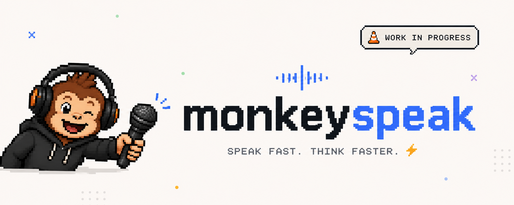
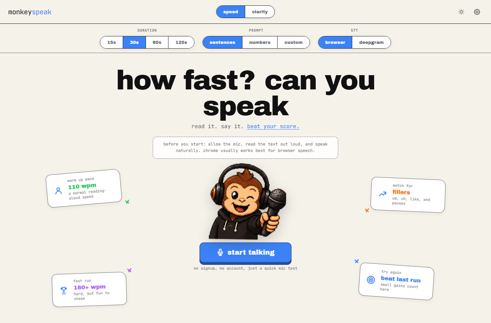
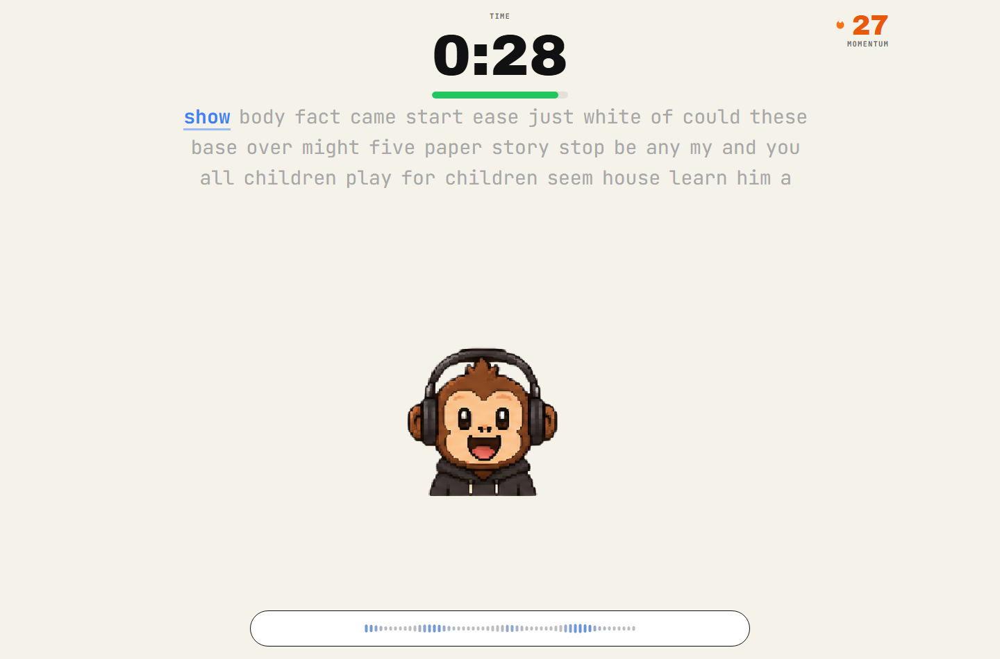
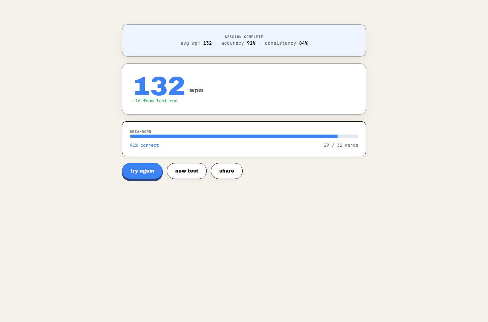

# monkeyspeak

what's launching: a tiny speaking benchmark. read prompts out loud, get a wpm score, chase one more personal best 🙊
(totally original idea hehehe)

check out [CONTRIBUTING.md](CONTRIBUTING.md) for the longer contributor guide - this readme is the fast version.



monkeyspeak is basically monkeytype but you use your voice. pick a prompt, hit start talking, and the app tracks how fast you spoke, what it actually heard, and whether too many ums snuck in while you were cooking.

works out of the box with browser speech recognition. no api key, no signup, just mic access and mild embarrassment when you misread the prompt.

## screenshots so you know what you cloned






## what it does (non-exhaustive)

- speed mode: 15s / 30s / 60s / 120s timed runs
- clarity mode: paste a transcript, get a word diff against the prompt -> to test against other stt
- live wpm while you talk
- filler cleanup for um, uh, like, and other verbal speed bumps
- words dissolve off the screen as the app hears them correctly
- home page leaderboard panel — duration tabs stay synced with the config bar, crown for top spots, your row pinned at the bottom
- global leaderboard — after a speed run pick a nickname + emoji, no signup, scores shared via Supabase for everyone on the site
- top score card shows your personal best for the current duration, not whoever is #1 on the board
- personal bests still saved locally per duration and prompt type
- themes, accent colors, fonts, blind mode, transcript toggles, the usual knobs

## get it running

you need node 20+ and a microphone. that's it for the default path.

```bash
git clone https://github.com/nothariharan/monkeyspeak.git
cd monkeyspeak
npm install
npm run dev
```

point your browser at http://localhost:3000, allow the mic, and try not to read like you are defusing a bomb.

sip some water. you're about to yapppppity yapppp

### browser speech (start here)

this is the easy path. try this first.

```bash
npm run dev
```

chrome is usually the smoothest. brave and edge work too but browser speech can get weird depending on the engine.
disclaimer: brave is little notorious coz of brave shields etc so be careful there


### deepgram? 

fair. deepgram gives you better live transcription and matches the production-style setup.

copy the env template:

```bash
cp .env.example .env.local
```

fill in `.env.local`:

```env
DEEPGRAM_API_KEY=your_deepgram_api_key_here
DEEPGRAM_PROJECT_ID=your_deepgram_project_id_here
NEXT_PUBLIC_DEEPGRAM_PROXY_URL=ws://localhost:8080/api/deepgram/proxy
```

boot both in two terminals:

```bash
# terminal 1
npm run dev

# terminal 2
npm run dev:backend
```

open settings in the app, flip stt provider to deepgram, and you should be good.

the deepgram api key stays on the server. the browser talks to your proxy, not straight to deepgram with the permanent key taped to the client.

in production the frontend on vercel talks to a render websocket proxy — health checks go through `/api/deepgram/proxy-health` on vercel so the browser never does a cross-origin fetch at the render url (learned that after a cors lecture from chrome).

### global leaderboard (optional)

scores are shared across everyone via Supabase Postgres. no accounts — just a nickname and emoji after a speed run.

1. create a [Supabase](https://supabase.com) project
2. run the migration in [supabase/migrations/001_leaderboard_entries.sql](supabase/migrations/001_leaderboard_entries.sql) (SQL editor or `supabase db push`)
3. add to `.env.local`:

```env
SUPABASE_URL=https://your-project.supabase.co
SUPABASE_SERVICE_ROLE_KEY=your_service_role_key_here
```

without those vars the app still runs; the board just shows a friendly error until you wire it up.

writes go through `POST /api/leaderboard` on vercel with the service role key. same name + board + higher wpm updates your row, lower wpm gets ignored.

## to get it up and speaking / running ( u see what i did here ? )

```bash
npm run dev              # next dev server
npm run dev:backend      # deepgram websocket proxy on port 8080
npm run dev:turbo        # next with turbopack
npm run dev:clean        # clear .next cache then dev
npm run build            # production build
npm start                # prod server + integrated proxy (server.js)
npm run lint             # eslint. do this before a pr
```

## keyboard shortcuts

- `Enter` - start a test, or next prompt after a run
- `Tab` - reset, stop, or retry depending on where you are
- `Escape` - bail on a running test early
- `Ctrl + ,` - open settings
- `Ctrl + 1` / `Ctrl + 2` - speed mode / clarity mode

## where stuff lives

```text
monkeyspeak/
  app/              pages and api routes (leaderboard, deepgram, proxy health)
  components/       ui, controls, results, hero leaderboard widgets
  components/game/  speaking test world, hud, graph, monkey
  hooks/            timer, speech providers, vad, leaderboard fetch
  lib/              prompts, scoring, diff, themes, leaderboard helpers
  lib/supabase/     server-only supabase admin client
  supabase/         migration sql for leaderboard_entries
  store/            zustand state + persisted settings
  public/           sprites, onnx model, audio workers
  backend/          standalone deepgram websocket proxy (render)
  server.js         prod next + proxy in one node process
  docs/             dev notes and screenshots
  patches/          patch-package fixes
```

touching the live speaking experience? start in [app/page.tsx](app/page.tsx), [components/game/SpeakingGame.tsx](components/game/SpeakingGame.tsx), and [hooks/](hooks).

touching scoring? [lib/alignTranscriptToPrompt.ts](lib/alignTranscriptToPrompt.ts), [lib/fillers.ts](lib/fillers.ts), [lib/stats/](lib/stats), [lib/diff.ts](lib/diff.ts).

touching the board? [app/api/leaderboard/route.ts](app/api/leaderboard/route.ts), [components/decor/HeroLeaderboard.tsx](components/decor/HeroLeaderboard.tsx), [components/decor/LeaderboardSavePrompt.tsx](components/decor/LeaderboardSavePrompt.tsx).

## env vars (when you care)

| variable | notes |
| --- | --- |
| `DEEPGRAM_API_KEY` | server side only. do not expose in client code |
| `DEEPGRAM_PROJECT_ID` | used for short-lived token creation |
| `NEXT_PUBLIC_DEEPGRAM_PROXY_URL` | browser websocket url. local: `ws://localhost:8080/api/deepgram/proxy`. prod: `wss://monkeyspeak.onrender.com/api/deepgram/proxy` |
| `SUPABASE_URL` | Supabase project url for the global leaderboard (server only) |
| `SUPABASE_SERVICE_ROLE_KEY` | service role key for leaderboard api routes. never expose to the client |
| `PORT` | optional. defaults to 3000 for the app, 8080 for backend |
| `NEXT_PUBLIC_DEBUG_STT` | set to `true` for browser speech logs |
| `DEBUG_DG_PROXY` | set to `1` for noisy proxy logs |

full copy-paste template lives in [.env.example](.env.example).

## production

live site: [monkeyspeak-delta.vercel.app](https://monkeyspeak-delta.vercel.app)

split deploy (what we run today):

| piece | host | job |
| --- | --- | --- |
| frontend + api routes | vercel | next app, leaderboard, deepgram token bridge, proxy health |
| websocket proxy | [render](https://monkeyspeak.onrender.com) | deepgram audio proxy only |

on vercel set `SUPABASE_URL`, `SUPABASE_SERVICE_ROLE_KEY`, and `NEXT_PUBLIC_DEEPGRAM_PROXY_URL=wss://monkeyspeak.onrender.com/api/deepgram/proxy`. render only needs the deepgram keys.

single-service option still works locally or on one node:

```bash
npm run build
npm start
```

`npm start` runs [server.js](server.js), which serves next and the deepgram proxy from the same process.

want render setup notes? see [backend/README.md](backend/README.md).

## before you open a pr

skim [CONTRIBUTING.md](CONTRIBUTING.md), then:

```bash
npm run lint
npm run build
```

also do one real speaking run in the browser. speech bugs love looking fine in typescript and then falling apart the second a microphone joins the party.

## license

mit. see [LICENSE](LICENSE).


