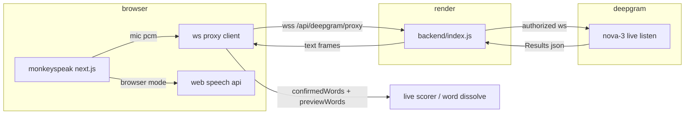

# monkeyspeak v0.1: speech works on every browser 🙊

follow-up to [v0](https://github.com/nothariharan/monkeyspeak). v0 shipped the game. v0.1 shipped the part where speech actually scores on chrome, brave, edge, and production.

---

## tl;dr

- deepgram mode now transcribes live text again (words dissolve, wpm moves, momentum still reacts to your voice)
- brave and edge no longer hang for 25 seconds then fake a mic error
- production uses a render websocket proxy + vercel env, same path that worked locally
- github: [nothariharan/monkeyspeak](https://github.com/nothariharan/monkeyspeak) (commit `095b731` and earlier speech routing work on `main`)
- live: [monkeyspeak-delta.vercel.app](https://monkeyspeak-delta.vercel.app)
- proxy: [monkeyspeak.onrender.com](https://monkeyspeak.onrender.com)

---

## what i changed

### speech routing (back to something that made sense)

| mode | behavior |
|------|----------|
| **browser** | web speech api only. no deepgram hijack on brave/edge mount. |
| **deepgram** | try deepgram first (proxy → bridge fallback on chrome only). if that fails, fall back to web speech with a clear error. |

the ui now shows errors for the provider that actually failed, not a generic "mic blocked" when stt died for other reasons.

### deepgram client hardening

- prefer `NEXT_PUBLIC_DEEPGRAM_PROXY_URL` websocket proxy over the vercel http bridge
- brave/edge without a reachable proxy: fail fast with a useful message (no 25s timeout)
- `utterance_end_ms` locked to `1000` everywhere (deepgram rejects live ws with `400` below that)
- bridge watchdog clears on `BridgeReady`, not on first random chunk
- server bridge waits for upstream deepgram before closing the socket

### the transcript fix (the big one)

- client parses deepgram json whether it arrives as a **string**, **blob**, or **arraybuffer**
- render proxy forwards deepgram replies as utf-8 **text** frames instead of opaque binary

### infra

- `backend/` express + `ws` proxy deployable on render (`render.yaml` included)
- vercel production env:

```env
NEXT_PUBLIC_DEEPGRAM_PROXY_URL=wss://monkeyspeak.onrender.com/api/deepgram/proxy
```

- redeployed frontend via vercel cli after env update

### small polish

- clearer vad fallback logs (worker load fail vs no voice detected vs timeout)
- config bar hint on brave/edge when browser mode is selected
- momentum sprites + gsap monkey states (from earlier in the sprint)

---

## what broke (and why it looked cursed)

1. brave and edge block or mishandle the vercel http audio bridge (duplex `fetch` upload), so deepgram connections hung ~25s and never returned transcripts.

2. those browsers also cannot open an authenticated websocket straight to `api.deepgram.com`, so they need the render ws proxy (`wss://…/api/deepgram/proxy`) instead of the chrome-friendly paths.

3. even after the proxy worked, deepgram sent json in binary ws frames and the client ignored anything that was not a string, so words never updated until we parsed blob/arraybuffer payloads.

## architecture rn



---

## what's next (maybe)

- vendor ort wasm for vad so the worker stops complaining
- gsap scale split for clean console
- render keep-alive or paid instance if cold starts hurt demos
- preview env on vercel for pr deployments (production is wired today)

---

sorry if i yapped a lot — the fixes were slightly more techy so i didn't want to over-explain here. lmk in replies if you want the deep dive.

