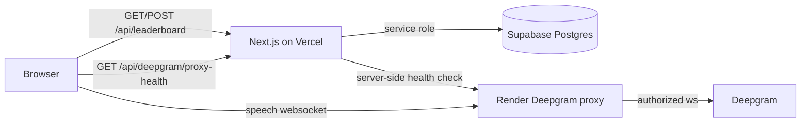

# monkeyspeak devlog after the speech fix (leaderboard + home + cors)

follow-up to [v0.1 speech on every browser](./devlog-v0.1-speech-on-every-browser.md). that one got deepgram talking again. this one is the home page actually feeling like a product and scores living somewhere that is not just your browser storage.

---

## tl;dr

- home page is a 3 column layout now — leaderboard on the left, hero in the middle, top score on the right
- global leaderboard via supabase — nickname + emoji after a run, no signup, same board for everyone on the site
- personal bests still local — top score card shows *your* best for the duration, not whoever is #1 globally
- supabase wired on vercel with service role key server side only (`/api/leaderboard` get + post)
- cors scream from chrome fixed — browser no longer fetches render root directly for proxy health checks
- github: [nothariharan/monkeyspeak](https://github.com/nothariharan/monkeyspeak) (`65be86f` leaderboard, `f3750f1` cors fix)
- live: [monkeyspeak-delta.vercel.app](https://monkeyspeak-delta.vercel.app)
- proxy still: [monkeyspeak.onrender.com](https://monkeyspeak.onrender.com)

---

## what i changed

### home page layout

| piece | what it does |
|------|----------------|
| **hero leaderboard** | duration tabs synced with config bar, crown svg for top spots, emoji avatars, your row pinned at the bottom even if you are not top 5 |
| **leaderboard save prompt** | pops after a speed run — pick name + icon (default 🐵), saves to supabase, remembers name locally for next time |
| **top score card** | personal best for current duration + prompt type only |
| **visual cleanup** | removed hero doodles, tightened title spacing, consolidated duplicate hero css |

leaderboard rows used to live in zustand localStorage. ripped that out — supabase is source of truth now. name and emoji prefills still persist locally.

### global leaderboard backend

- new table `leaderboard_entries` in supabase (migration in `supabase/migrations/001_leaderboard_entries.sql`)
- rls enabled, no anon policies — all reads/writes through next.js with `SUPABASE_SERVICE_ROLE_KEY`
- upsert rule matches old local behavior: same name + duration + prompt type (case insensitive) only updates if wpm goes up
- light rate limit on post (~30s per ip) — good enough for hobby scale, not fortress grade

```text
browser → GET/POST /api/leaderboard (vercel)
              ↓ service role
         supabase postgres
```

render backend unchanged — still deepgram only, no db env vars there.

### cors fix (chrome was mad again)

production deepgram mode probes whether the render proxy is alive before connecting. that probe used to be a cross origin `fetch` at `https://monkeyspeak.onrender.com/` from the vercel app.

render cold starts and error pages often ship **without** cors headers even when express has `origin: *` — so chrome logged the whole blocked by cors policy thing and deepgram mode thought the proxy was dead.

fix: new same origin route `GET /api/deepgram/proxy-health` on vercel. server checks render, browser never touches render over http cors. also slapped explicit options handling on the render backend for anything that still hits it directly.

### security pass (quick)

ran a review on the leaderboard diff. nothing critical — service role stays server side, no xss sinks in the ui. three medium notes for later if abuse shows up:

- scores are honor system — anyone can post fake wpm with curl until we add signed run tokens
- in memory rate limit does not survive vercel spinning up extra function instances
- blocked `%` and `_` in nicknames so ilike lookup cannot go wild

fine for v1. rotate keys if you pasted them in chat ( guilty ).

### docs + readme

- readme refreshed — supabase setup, split vercel/render production table, tile2 monkey sprite middle + end ( retired main_mon and side_mon )
- `.env.example` + contributing pointer for supabase vars

---

## what broke (and why it looked cursed)

1. **leaderboard 503 on prod** — code shipped before `SUPABASE_URL` + service role were on vercel. api returns friendly "not configured" until env is set.

2. **cors on render root** — not really broken cors on express, broken assumption that browser health checks are free. vercel → render fetch from the client is a trap.

3. **stale dev server** — local post to `/api/leaderboard` 404'd until restart because next had not picked up the new route. classic.

4. **confused supabase url with anon key** — dashboard shows a jwt under "anon public". project url is `https://<ref>.supabase.co`. service role is the secret one for server routes.

---

## architecture rn



---

## what's next (maybe)

- signed run tokens so leaderboard posts are tied to an actual finished test
- shared rate limit (redis/kv) if spam shows up
- delete the testmonkey row sitting on prod from smoke testing
- render keep alive still on the list from v0.1
- preview env on vercel for prs

---

ok that was a lot of infra for a monkey with a crown svg but at least the board is real now. lmk in replies if you want the supabase dashboard walkthrough or the security fixes implemented properly.
